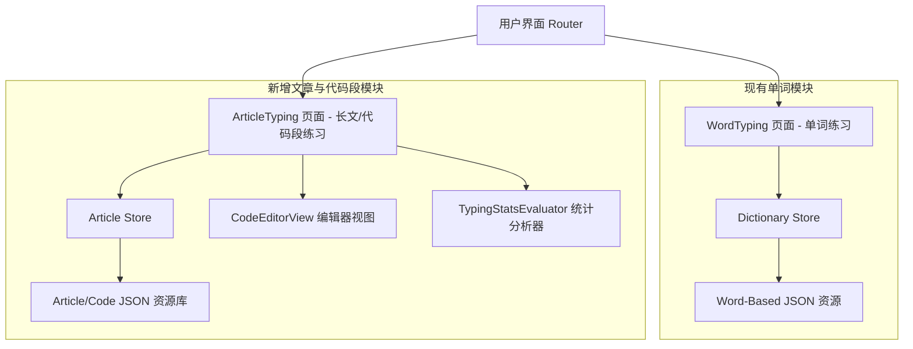
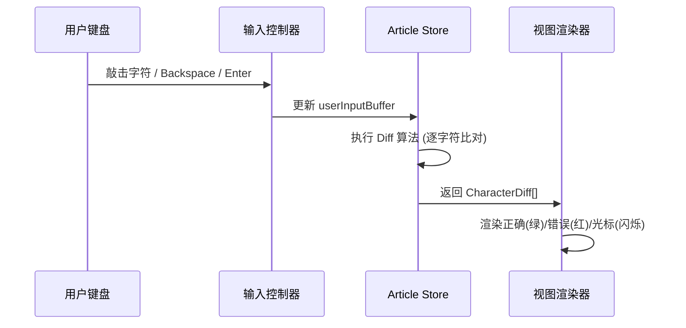

# Qwerty Learner 整篇文章与代码片段练习模块（Article Typing）详细设计方案

## 1. 背景与概述

在 `qwerty-learner` 现有架构中，打字练习主要基于离散词条（Word-based）模式。虽然代码分类（如 `js-array.json`、`python-builtin.json`）收录了编程语言的 API 和关键字，但受限于单词卡片的呈现形式，缺乏对真实代码结构（如多行缩进、上下文连贯性、标点符号组合）以及长篇英文段落的练习支持。

本设计方案旨在拓展系统的练习范式，新增**整篇文章与代码片段练习模块（Article Typing Module）**。该模块采用**“自由可编辑（支持 Backspace 退格与修正） + 字符级 Diff 比对 + 综合准确率结算”**的核心机制，提升长文本与连续代码输入的练习体验。

---

## 2. 系统总体架构

新增模块与现有单词练习模块并行，共享底层的通用配置（如音效、主题），但拥有独立的数据范式、状态管理与视图渲染逻辑。



### 模块职责拆分
- **Article Resource Manager**：负责长文本/代码片段 JSON 资源的加载、解析与分段。
- **Article Store (State Management)**：管理用户输入缓冲区、目标文本缓冲区、光标坐标、计时器与按键日志。
- **CodeEditorView Component**：渲染代码/文本视图，处理行号、语法高亮、字符级差异颜色标记及光标定位。
- **Input & Event Handler**：捕获键盘事件（普通字符、`Backspace`、`Enter`、`Tab`），维护输入缓冲区。
- **Metrics Evaluator**：实时计算 KPM、WPM、准确率、修正频率及错误字符分布。

---

## 3. 数据范式与资源定义

### 3.1 资源元数据范式 (`ArticleResource`)

在 [src/typings/resource.ts](file:///Users/kwangwah/Project/qwerty-learner/src/typings/resource.ts) 中增加文章/代码片段资源的类型定义：

```typescript
export type ArticleCategory = '代码片段' | '英文文章' | '技术文档' | '自定义'

export type ArticleResource = {
  id: string
  name: string
  description: string
  category: ArticleCategory
  tags: string[]
  language: 'javascript' | 'typescript' | 'python' | 'cpp' | 'java' | 'go' | 'english'
  url: string
  length: number           // 总字符数
  lineCount: number        // 总行数
  author?: string
  license?: string
}
```

### 3.2 资源内容范式 (`ArticleContent`)

用于存放具体的文本内容 JSON：

```typescript
export type ArticleContent = {
  id: string
  title: string
  language: string
  codeLanguage?: string    // 语法高亮类型 (例如 'typescript', 'python')
  content: string          // 完整文本字符串
  lines: string[]          // 按 '\n' 拆分后的每行字符串数组
}
```

#### 数据 JSON 样例 (`public/articles/js-design-patterns.json`)
```json
{
  "id": "js-singleton",
  "title": "JavaScript Singleton Pattern",
  "language": "code",
  "codeLanguage": "javascript",
  "content": "class Singleton {\n  constructor() {\n    if (!Singleton.instance) {\n      Singleton.instance = this;\n    }\n    return Singleton.instance;\n  }\n}",
  "lines": [
    "class Singleton {",
    "  constructor() {",
    "    if (!Singleton.instance) {",
    "      Singleton.instance = this;",
    "    }",
    "    return Singleton.instance;",
    "  }",
    "}"
  ]
}
```

---

## 4. 自由编辑与双缓冲区状态模型

为实现“不掐死错误、允许 Backspace 回删”的要求，系统采用**目标缓冲区 (Target Buffer)** 与 **用户输入缓冲区 (User Buffer)** 双流比对模型。



### 4.1 状态结构 (`ArticleTypingState`)

```typescript
export type TextCharacterState = 'correct' | 'wrong' | 'pending' | 'cursor'

export type CharacterDiff = {
  char: string           // 目标字符
  userChar?: string      // 用户输入的实际字符
  state: TextCharacterState
}

export type ArticleTypingState = {
  // 资源信息
  articleContent: ArticleContent | null
  
  // 双缓冲区
  targetText: string
  userInputBuffer: string // 用户当前输入的完整字符串
  
  // 位置坐标 (根据 userInputBuffer.length 计算)
  currentLineIndex: number
  currentCharIndex: number
  
  // 打字统计数据
  totalKeystrokes: number   // 总按键次数
  errorKeystrokes: number   // 发生错误的累计次数
  backspaceCount: number    // 退格使用次数
  startTime: number | null
  endTime: number | null
  
  // 标志位
  isTyping: boolean
  isFinished: boolean
}
```

---

## 5. 交互逻辑与按键处理

### 5.1 键盘事件捕获逻辑

通过受控的文本输入层（隐式 `textarea` 或全局 `keydown` 监听）响应用户的键盘事件：

```typescript
function handleKeyDown(event: React.KeyboardEvent, state: ArticleTypingState, dispatch: Dispatch) {
  const { key, ctrlKey, metaKey } = event

  // 1. 拦截组合功能键（如 Ctrl+R, Cmd+C 等），避免干扰
  if (metaKey || ctrlKey) {
    if (key === 'Backspace') {
      // 支持按词/按行批量删除
      dispatch({ type: 'DELETE_WORD' })
      event.preventDefault()
    }
    return
  }

  // 2. 退格键处理 (Backspace)
  if (key === 'Backspace') {
    event.preventDefault()
    if (state.userInputBuffer.length > 0) {
      dispatch({ type: 'HANDLE_BACKSPACE' })
    }
    return
  }

  // 3. 换行键处理 (Enter)
  if (key === 'Enter') {
    event.preventDefault()
    dispatch({ type: 'APPEND_INPUT', payload: '\n' })
    return
  }

  // 4. Tab 键处理 (代码缩进)
  if (key === 'Tab') {
    event.preventDefault()
    // 默认转换为 2 个空格
    dispatch({ type: 'APPEND_INPUT', payload: '  ' })
    return
  }

  // 5. 普通可打印字符输入
  if (key.length === 1) {
    event.preventDefault()
    dispatch({ type: 'APPEND_INPUT', payload: key })
  }
}
```

### 5.2 自动缩进辅助（可选配置）
针对代码练习，提供“智能缩进辅助”开关：
- 当开启时：在按 `Enter` 换行后，系统自动比对下一行的前导空格数，若用户按下 `Tab` 或 `Enter` 可自动补齐下一行的前导缩进，降低繁琐的空格敲击负担。

---

## 6. 统计指标与算法

在允许自由编辑和回删的前提下，系统依据以下算法客观评估练习效果：

### 6.1 指标计算公式

| 指标 | 公式 | 说明 |
| :--- | :--- | :--- |
| **正确字符数 ($C_{correct}$)** | $\sum_{i=0}^{N-1} [userInputBuffer[i] == targetText[i]]$ | 当前与目标文本完全匹配的字符数量 |
| **实时准确率 ($Accuracy$)** | $\frac{C_{correct}}{\max(userInputBuffer.length, 1)} \times 100\%$ | 当前已输入内容中的正确率 |
| **有效 KPM ($KPM_{net}$)** | $\frac{C_{correct}}{T_{seconds} / 60}$ | 每分钟有效敲击字符数 |
| **净 WPM ($WPM_{net}$)** | $\frac{C_{correct} / 5}{T_{seconds} / 60}$ | 国际标准：以 5 字符作为一个标准单词 |
| **纠错频率 ($BackspaceRate$)** | $\frac{backspaceCount}{totalKeystrokes} \times 100\%$ | 退格键占总按键比例，反映输入的犹豫程度 |

---

## 7. UI/UX 界面设计规范

采用类似现代代码编辑器的深色/浅色沉浸式界面：

```
+-----------------------------------------------------------------------+
|  [代码练习] JS 单例模式                        WPM: 64  Acc: 98.2%  01:25 |
+-----------------------------------------------------------------------+
| 01 | class Singleton {                                                |
| 02 |   constructor() {                                                |
| 03 |     if (!Singleton.instance) {                                   |
| 04 |       Singleton.instanc| = this;   <-- (红色表示错字，|表示闪烁光标) |
| 05 |     }                                                            |
| 06 |     return Singleton.instance;                                   |
| 07 |   }                                                              |
| 08 | }                                                                |
+-----------------------------------------------------------------------+
| [Esc] 重考  [Tab] 缩进  [Backspace] 修正                             |
+-----------------------------------------------------------------------+
```

### 7.1 视觉样式逻辑
- **正确字符**：使用主题默认字色（浅灰/黑字），透明度 100%。
- **错误字符**：红色背景高亮（`bg-red-500/30 text-red-400`），并显示用户实际敲错的字符。
- **光标**：带呼吸灯动画的纵向竖线（`border-r-2 border-primary animate-pulse`）。
- **未输入字符**：低对比度灰色（`text-muted-foreground/40`）。

---

## 8. 实施路径与工期规划

| 阶段 | 任务内容 | 预估里程碑 |
| :--- | :--- | :--- |
| **第一阶段：数据与 Store** | 定义 `ArticleResource` 类型；编写 `useArticleStore` 及双缓冲区 reducer；准备 5-10 篇基础代码/长文 JSON 数据 | 数据模型与状态流转调优 |
| **第二阶段：编辑器视图开发** | 开发 `CodeEditorView` 组件；实现多行渲染、动态光标定位与字符 Diff 高亮；处理 `Backspace`/`Enter`/`Tab` 按键 | 完成文本渲染与按键响应 |
| **第三阶段：统计与结算** | 开发 `TypingStatsEvaluator`；计算 WPM/KPM/Acc；设计完成后的结算弹窗与错字分布展示 | 核心功能闭环 |
| 第四阶段：路由与资源库整合| 在 Gallery / 导航栏中接入“长文/代码练习”入口；支持自定义文本粘贴练习 | 全面集成上线 |

---

## 9. 初学者友好设计：阶梯式学习曲线与代码注释机制

针对编程初学者，纯粹的代码敲击练习如果缺乏合理的难度梯度与语义注解，极易产生较高的认知负荷与挫败感。因此，资源库的建设与交互设计必须深度兼顾**“教学递进”**与**“代码理解”**。

### 9.1 阶梯式学习曲线 (Progressive Learning Curve)

练习资源按照难度分为 4 个递进阶梯，初学者可根据自身水平逐步解锁：

| 难度等级 | 分组名称 | 核心练习目标 | 代码范例/资源内容 |
| :--- | :--- | :--- | :--- |
| **Level 1** | **基础语法与控制流** | 习惯常见关键字、分支语句、基本标点 (`;`, `{}`) | 变量声明、`if-else` 分支、`for/while` 简单循环 |
| **Level 2** | **数据结构与常用 API** | 习惯点号链式调用、回调函数结构、数组与对象操作 | `Array.prototype.map/filter`、`JSON.parse`、字典/Map 操作 |
| **Level 3** | **面向对象与异步编程** | 练习类声明、继承、`Promise` 及 `async/await` 结构 | 类定义、异步请求封装、闭包与事件监听 |
| **Level 4** | **实战工程 Snippets** | 真实的短小精悍开源库代码片段、算法实现 | Express 路由处理器、React Hook 定义、常见设计模式 |

---

### 9.2 代码注释与语义解构机制 (Comments & Explanation)

代码注释对于初学者理解代码语义、形成“音形意/逻辑”联动至关重要。但在键盘敲击体验中，中文注释的输入会因输入法 (IME) 切换而打断节奏。系统采用以下**双模注释交互机制**：

```
+-----------------------------------------------------------------------+
|  [代码练习] Level 1: 条件判断                                          |
+-----------------------------------------------------------------------+
| // 💡 提示：检查用户是否已成年 (中文注释作为只读解构说明，不参与打字)   |
| 01 | if (user.age >= 18) {                                            |
| 02 |   // Set user status to adult                                    |
| 03 |   user.isAdult = true;                                           |
| 04 | }                                                                |
+-----------------------------------------------------------------------+
```

1. **中文说明注释 —— 只读背景注解 (Read-Only Explanation Cards)**：
   - 中文注释以**解构卡片/顶部淡色行**的形式展现，仅作为语义提示，**系统自动跳过中文注释的敲击比对**。
   - 初学者在敲击代码行的同时，能清晰阅读上方或旁侧的中文逻辑说明，降低理解门槛。

2. **英文代码注释 —— 可选输入 (Optional Comment Typing)**：
   - 英文原装注释（如 `// Return default fallback`）作为标准字符的一部分。
   - 提供设置项：`[√] 练习英文注释` / `[ ] 跳过注释仅练习代码`，由用户按需配置。

---

## 10. 资源构建与注释标记 DSL 规范

为区分**“输入型注释（参与打字比对）”**与**“非输入型注释（只读背景卡片）”**，在资源构建层面**无需发明重型复杂的 DSL 语言**，但**非常适合设计一套轻量级注释标记协议（Lightweight Comment Protocol）**，以降低资源贡献者的编写门槛。

### 10.1 轻量级标记协议 (Comment Protocol Specification)

在代码源文件（如 `.js`, `.py`, `.md`）中，通过在注释头增加特定前缀符号区分类型：

| 标记语法 | 类型定义 | 前端渲染与交互行为 |
| :--- | :--- | :--- |
| `//: [内容]` 或 `/*: [内容] */` | **非输入型解构说明 (Explanation)** | 渲染为只读卡片/顶部淡色行，**打字光标自动跳过** |
| `// [内容]` 或 `/* [内容] */` | **输入型代码注释 (Typing Comment)** | 作为代码内容对待，光标需正常敲击（可按设置项开启/跳过） |
| `[普通代码行]` | **Executable Code** | 标准代码字符流，严格比对输入 |

#### 源码编写范例 (`resources/articles/javascript/closure.js`)
```javascript
//: 💡 闭包示例：函数内部返回一个持有外部变量的闭包函数
function createCounter() {
  //: 声明局部变量 count
  let count = 0;
  
  // Increment and return current count
  return function() {
    count++;
    return count;
  };
}
```

---

### 10.2 资源编译与数据结构 (Parsed Token Line AST)

在资源编译阶段（打包脚本或前端加载解析时），将上述源码文件解析为前端渲染引擎直接消费的结构化数据：

```typescript
export type LineType = 'explanation' | 'comment' | 'code'

export type ArticleLineToken = {
  lineIndex: number
  type: LineType
  text: string
  isTypable: boolean  // 是否参与键盘敲击比对
}

export type ParsedArticleContent = {
  id: string
  title: string
  tokens: ArticleLineToken[]
}
```

#### 解析输出结果示例
```json
{
  "id": "js-closure",
  "title": "闭包示例",
  "tokens": [
    {
      "lineIndex": 0,
      "type": "explanation",
      "text": "💡 闭包示例：函数内部返回一个持有外部变量的闭包函数",
      "isTypable": false
    },
    {
      "lineIndex": 1,
      "type": "code",
      "text": "function createCounter() {",
      "isTypable": true
    },
    {
      "lineIndex": 2,
      "type": "explanation",
      "text": "声明局部变量 count",
      "isTypable": false
    },
    {
      "lineIndex": 3,
      "type": "code",
      "text": "  let count = 0;",
      "isTypable": true
    },
    {
      "lineIndex": 4,
      "type": "comment",
      "text": "  // Increment and return current count",
      "isTypable": true
    }
  ]
}
```

### 10.3 方案优势评估
1. **创作者极其友好**：无需手动编写复杂的 JSON 嵌套节点，直接在任意代码编辑器里按照 `//:` 语法写代码和注释即可。
2. **解析极其轻量**：解析逻辑仅需几行正则表达式匹配，解析性能极高（不到 1ms）。

---

## 11. 工程优化方案与落地路线图（2026-08 增补）

基于全仓调研（对照 §1–§10 设计、开发日志与现网代码），对 Article Typing 模块与工程集成给出可执行优化方案。原则：**共享基础设施，隔离领域状态**（禁止文章页复用 `TypingContext` / `StartButton` / `Switcher`）。

### 11.1 设计 vs 实现完成度（基线）

| 设计阶段 | 完成度 | 说明 |
| :--- | :---: | :--- |
| 一：数据与 Store | ~70% | 类型/解析/双缓冲已有；资源偏少；宜仅持久化 articleId |
| 二：编辑器视图 | ~65% | Diff/毛玻璃/滚动已有；语法高亮/智能缩进/跳过注释待做 |
| 三：统计与结算 | ~40% | 有简易 WPM/Acc；缺错字分布、Dexie、统一 metrics |
| 四：路由与资源库 | ~55% | Gallery 文章 Tab 已有；主页入口弱；双 Gallery 冗余 |

### 11.2 关键问题清单

| ID | 优先级 | 问题 | 处置策略 |
| :--- | :---: | :--- | :--- |
| B1 | P0 | 首键仅 `START_TYPING` 后 return，首字符被吞 | 启动后继续处理同一按键；`APPEND_INPUT` 可自启计时 |
| B2 | P0 | `buffer.length >= target.length` 即完成，错字也可通关 | 全文字符归一化匹配后才 `isFinished` |
| B3 | P0 | 从文章页进 Gallery 固定单词模式 | `galleryMainModeAtom` + `?mode=article` |
| B4 | P0 | 主页无文章入口，功能难发现 | Header 增加「📄 文章」跳转 |
| B5 | P1 | `atomWithStorage` 存整篇 content | 仅存 `currentArticleId`，派生资源对象 |
| B6 | P1 | `ArticleGallery` / `ArticleDictModal` 与 Gallery-N 重复 | 画廊统一 Gallery-N；`/article-gallery` 重定向 |
| B7 | P1 | 无按键音效 / Esc 暂停 | 复用 `useKeySounds`；Esc/失焦暂停 |
| B8 | P1 | Acc 未统计 `errorKeystrokes` / BackspaceRate | 抽 `metrics.ts` 纯函数，与设计 §6 对齐 |
| B9 | P2 | 无 Dexie 历史 / Analysis | Sprint B 扩展 `articleSessionRecords` |
| B10 | P2 | 资源与 `public/articles` 双轨 | 后续统一编译管线 |

### 11.3 架构约束（强制）

```
共享：Layout / Header 壳 / 深色模式 / 音效 atom / Gallery 外壳
隔离：ArticleTyping 自有 reducer；禁止 useContext(TypingContext)
持久化：currentArticleId + galleryMainMode（非整篇 content）
入口：/ → 文章练习；/article-typing → Gallery?mode=article；/gallery 记忆 mode
```

推荐演进目录（可渐进迁移，不要求一次搬完）：

```
src/pages/ArticleTyping/
  store/          # reducer + type
  metrics.ts      # Acc / WPM / KPM / BackspaceRate / isComplete
  components/     # CodeEditorView 等
  index.tsx       # 页面组装 + 输入层
src/utils/articleParser.ts
src/resources/articleDictionary.ts
```

### 11.4 指标口径（落地版，对齐 §6）

| 指标 | 公式 |
| :--- | :--- |
| $C_{correct}$ | 位置 $i$ 上 `isCharMatch(target[i], buffer[i])` 的个数 |
| Accuracy | $C_{correct} / \max(\|buffer\|, 1) \times 100\%$ |
| KPM / WPM | $C_{correct}$ 与 $C_{correct}/5$ 除以分钟数 |
| BackspaceRate | $backspaceCount / \max(totalKeystrokes, 1) \times 100\%$ |
| 完成 | $\|buffer\| \ge \|target\|$ 且前 $\|target\|$ 位全部匹配 |

输入缓冲区长度 **钳制** 在 `targetText.length`，避免越界后永远无法完成。

### 11.5 迭代路线图

#### Sprint A — 稳与顺（当前落地）

1. 修首键吞字符、完成判定、metrics 纯函数与 errorKeystrokes  
2. `currentArticleId` 持久化；Gallery `mode` 记忆与 query  
3. 主页 / 文章页 Header 互跳入口  
4. 按键音效 + Esc/失焦暂停  
5. `/article-gallery` → `/gallery?mode=article`  

#### Sprint B — 练习闭环

1. 结算面板错字分布  
2. Dexie `articleSessionRecords` + Analysis 轻量 Tab  
3. `skipComments` / Tab 宽度 / 智能缩进开关  
4. 资源扩至 10–15 篇（L1–L4）  

#### Sprint C — 体验与规模

1. 源码 → JSON 编译管线与贡献文档  
2. 自定义粘贴练习  
3. 可选语法高亮；unit + e2e；路由 lazy  

#### Sprint D — 差异化（可选）

错题片段复习、成绩分享图、桌面端长文优化。

### 11.6 验收标准（Sprint A）

- [x] `/article-typing` 无白屏；首键同时揭开遮罩并写入字符  
- [x] 末位错字不可完成；改对后可完成并显示 BackspaceRate  
- [x] 单词页可见「文章」入口；文章页词典链到 Gallery 文章模式  
- [x] 刷新后仍记住所选文章 id 与 Gallery 主模式  
- [x] 开启全局键音时文章练习有点击/错误反馈  
- [x] `npm run build` 通过（2026-08-07）  

> Sprint A 已落地，详见 `docs/article_typing_development_log.md` TASK-07～09。

---

## 12. 交互与配置作用域答疑（产品决策）

### 12.1 「任意键开始」是否写入首字符？

**否。** 准备态（毛玻璃遮罩、`userInputBuffer` 为空）下：

| 按键 | 行为 |
| :--- | :--- |
| 任意非修饰键 | **仅** `START_TYPING`（揭开遮罩、开始计时），**不**写入缓冲区 |
| 揭开后的第二键起 | 正常录入 |
| 暂停后（已有输入） | 任意键恢复，并处理本次输入 |
| 结算后「再练一遍」 | `RESET` + 立即 `START_TYPING`，**不再**出现毛玻璃「按任意键开始」 |

设计文案「按任意键开始练习」语义是 **ready → running**，不是把「开始键」当成练习内容。

### 12.2 实时指标放 Header 还是底部？

**对齐单词模式：放页面底部指标卡（`ArticleSpeed`），不进 Header 工具栏。**

| 区域 | 单词模式 | 文章模式 |
| :--- | :--- | :--- |
| Header | 词典/章节、发音、音效、默写…、Start | 模式切换、文章名、音效/深色、Start/Pause |
| 底部 | `Speed`：时间/输入数/WPM/正确数/正确率 | `ArticleSpeed`：时间/WPM/KPM/正确率/退格率/进度 |

不把 WPM 等塞进 Header 去「凑长度」——单词模式的工具栏长是因为 **功能开关多**，不是因为指标在工具栏里。

### 12.3 单词模式设置对文章是否生效？是否冲突？（完整决策）

#### 12.3.1 总原则

```
┌─────────────────────────────────────────────────────────┐
│  全局偏好（两端共用、改一次两边生效）                      │
│  深色 / 键音 / 提示音 / 外语字号（文章按比例缩放）          │
└─────────────────────────────────────────────────────────┘
          │                              │
          ▼                              ▼
┌──────────────────────┐    ┌──────────────────────────────┐
│ 单词领域（仅 /）       │    │ 文章领域（仅 /article-typing） │
│ 默写·循环·发音·释义    │    │ 跳过注释·Tab·智能缩进…        │
│ 章节乱序·前后词·忽略大小写│  │ 独立 atom，独立设置入口       │
│ 错题本·章节记录        │    │ 未来：文章会话记录             │
└──────────────────────┘    └──────────────────────────────┘
```

- **不会数据冲突**：两边写的是不同 atom / 不同 Dexie 表；全局项是「共享值」，不是两套互斥值。  
- **会语义冲突的只有「硬复用单词组件」**：如把 `Setting` / `WordDictationSwitcher` 挂到文章页（依赖 `TypingContext` → 白屏）。  
- **文章页禁止打开单词完整 Setting 对话框**；可复用其中无 Context 的子面板（如 `SoundSetting` 里的键音区块），或独立 `ArticleSetting`。

#### 12.3.2 单词 Setting / 工具栏逐项对照

| 来源 | 配置项 | 存储 | 文章是否生效 | 冲突？ | 说明 |
| :--- | :--- | :--- | :---: | :---: | :--- |
| 深色按钮 | 深色模式 | `isOpenDarkModeAtom` | ✅ | 无 | 全局 UI |
| 音效 | 按键音开关/音量/音色 | `keySoundsConfigAtom` | ✅ | 无 | 文章已 `useKeySounds` |
| 音效 | 对/错提示音 | `hintSoundsConfigAtom` | ✅ 部分 | 无 | 文章用错误提示音；「正确音」未每字播放（避免吵） |
| SoundSetting | 单词/释义发音 | `pronunciationConfigAtom` | ❌ | 无 | 词条发音模型，文章无词条 |
| ViewSetting | 外语字号 | `fontSizeConfig.foreignFont` | ✅ 间接 | 无 | 文章用 `×0.42` 夹在 16–28px |
| ViewSetting | 中文/释义字号 | `translateFont` | ❌ | 无 | 文章无单词释义行 |
| Advanced | 章节乱序 | `randomConfigAtom` | ❌ | 无 | 章节词表概念 |
| Advanced | 上/下一个单词 | `isShowPrevAndNextWordAtom` | ❌ | 无 | 词卡 UI |
| Advanced | 忽略大小写 | `isIgnoreCaseAtom` | ❌ 当前 | 无* | *若文章将来支持「忽略大小写」应单独开关或明确复用 |
| Advanced | 文本可选择 | `isTextSelectableAtom` | ❌ 当前 | 无 | 文章区现为 select-none |
| Advanced | 悬停显示答案 | `isShowAnswerOnHoverAtom` | ❌ | 无 | 默写场景 |
| 工具栏 | 默写模式 | `wordDictationConfigAtom` | ❌ | **禁复用** | 依赖 TypingContext |
| 工具栏 | 单词循环 | `loopWordConfigAtom` | ❌ | **禁复用** | 词条循环 |
| 工具栏 | 释义显示 | TypingState | ❌ | **禁复用** | 章节状态 |
| 工具栏 | 发音切换 | pronunciation | ❌ | 无 | 文章无 |
| 工具栏 | 错题本 / Analysis | word Dexie | ❌ | 无 | 数据域不同 |
| DataSetting | 导入导出 | word/chapter 表 | ❌ 对文章 | 无 | 不含文章会话；扩展表后需一并导出 |
| 词典/章节 | dictId / chapter | 单词 | ❌ | 无 | 文章用 `currentArticleId` |

\*「无冲突」= 改单词侧不会写坏文章状态；「不生效」≠ 坏，只是文章逻辑不读该开关。

#### 12.3.3 产品结论（直接回答）

1. **单词设置不会整体「自动套」到文章**；只有标为「全局」的几项会两边一起变。  
2. **不存在配置值互相覆盖的冲突**；危险点是组件级误复用。  
3. **用户在单词 Setting 里改的「默写/发音/乱序」对文章练习无影响**——这是预期行为，不是 bug。  
4. **字号、键音、深色**在两边应保持一致体验（已部分落地）。

### 12.4 完成祝贺是否用弹窗？

**是。** 对齐单词 `ResultScreen`：全屏遮罩 + 居中卡片（`ArticleResultModal`），展示最终 WPM/KPM/正确率/退格率/错误键等，支持「再练一遍 / 换一篇 / 关闭」。

### 12.5 文章模式是否要匹配一套配置项？

**要有「对等体验」的配置入口，但不要 1:1 克隆单词 Setting。**

| 维度 | 决策 |
| :--- | :--- |
| 要不要独立配置？ | **要**。文章有代码/长文特有选项，单词 Setting 装不下也装不对。 |
| 是否复制全量 Tab？ | **否**。声音/外观可共享；高级/数据/发音不照搬。 |
| UI 形态 | Header 齿轮 → `ArticleSetting` 弹窗（可与单词 Setting 同视觉壳） |
| 存储 | `articleTypingConfigAtom`（独立 key），不与 word 配置混写 |

#### 推荐配置清单（文章专用 + 共享入口）

| 分组 | 项 | 类型 | 优先级 | 备注 |
| :--- | :--- | :--- | :---: | :--- |
| 共享（只读引用全局） | 深色、键音、提示音、外语字号 | 全局 atom | P0 | 可跳转说明「与单词设置共用」 |
| 练习行为 | 跳过英文注释（`//` 行不参与比对） | 文章 atom | P1 | 设计 §9.2 |
| 练习行为 | Tab 宽度（2 / 4 空格） | 文章 atom | P1 | |
| 练习行为 | 智能缩进（Enter 后补齐下一行缩进） | 文章 atom | P1 | 设计 §5.2 |
| 练习行为 | 忽略大小写（可选） | 文章 atom 或复用 | P2 | 默认关，代码练习通常要区分 |
| 练习行为 | 自动滚动光标行 | 文章 atom | P2 | 现已默认开 |
| 显示 | 说明卡片（`//:`）显示/隐藏 | 文章 atom | P2 | |
| 数据（远期） | 文章练习历史 / 导出 | 新 Dexie 表 | P2 | 不进现有 DataSetting 除非扩展 |

#### 明确不需要进文章配置的单词项

默写、单词循环、释义、音标、章节乱序、上/下词、悬停答案、错题本章节——**全部保留仅单词**。

#### 落地节奏

| 阶段 | 内容 |
| :--- | :--- |
| ✅ 已落地 | Header：`SoundSwitcher` + **ArticleSetting 齿轮** + 深色 + Start；`articleTypingConfigAtom` |
| ✅ 已接线 | skipComments / tabWidth / smartIndent / ignoreCase / showExplanations / autoScroll |
| ⏳ Sprint C | 历史记录、导出、与 Analysis 联动 |

原则：**共享全局偏好，隔离领域选项；形态对齐、语义分轨。**

资源编写与标记协议见：**[article_resource_authoring_guide.md](./article_resource_authoring_guide.md)**。

### 12.7 Gallery 关闭回跳规则

| 场景 | 关闭 / Esc 回跳 |
| :--- | :--- |
| 从**单词练习**打开词典（`state.from=word`） | 始终回 `/`，即使在 Gallery 内切到了文章 Tab |
| 从**文章练习**打开字典（`state.from=article`） | 始终回 `/article-typing`，即使切到了单词 Tab |
| 在 Gallery 内**点选**某篇/某词典 | 进入对应练习页（主动选择，非关闭） |

进入来源在打开时锁定（`entryFromRef`），与 `galleryMainModeAtom`（仅控制 Tab 展示）解耦。

### 12.6 视觉统一：准备遮罩与练习区

| 项 | 单词模式 | 文章模式（对齐后） |
| :--- | :--- | :--- |
| 准备/暂停提示 | `backdrop-blur-sm` + 居中「按任意键开始/继续」，**底下单词仍可见** | 同：轻 blur，无实色盖板、无厚重卡片 |
| 对错配色 | green / red / gray（Letter） | 同色系 |
| 字号 | `fontSizeConfig.foreignFont`（默认 48） | `clamp(16, foreignFont×0.42, 28)`，随全局字号联动 |
| 练习区宽度 | 居中主内容 | `max-w-5xl`，高度约 `52–68vh` |
| 底部指标 | Speed 半透明卡 | ArticleSpeed 同形态 |

